# BursaTrack — Solution Architecture Document

**Document version:** 1.1  
**Date:** 2026-06-28  
**Author:** Principal Software Architect  
**Status:** Final — post-review revision (Architecture Review 2026-06-28)  
**Primary inputs:**

- BursaTrack-ADR-Summary.md v1.0
- BursaTrack-Technical-Discovery.md v1.0
- BursaTrack-BAS-Enhanced-Part1/2/3.md v2.0
- BursaTrack-PRD-Final.md v2.0
- BursaTrack-UX-Spec-Part1/2/3.md v1.1

Every architectural decision in this document is traceable to the Architecture Decision Records in BursaTrack-ADR-Summary.md. No decisions have been introduced that were not explicitly approved during the Architecture Decision Workshop.

---

## Table of Contents

1. [Executive Summary](#1-executive-summary)
2. [Goals](#2-goals)
3. [Non-Goals](#3-non-goals)
4. [Scope](#4-scope)
5. [Architectural Principles](#5-architectural-principles)
6. [Architecture Overview](#6-architecture-overview)
7. [High-Level Architecture](#7-high-level-architecture)
8. [System Components](#8-system-components)
9. [Data Flow](#9-data-flow)
10. [Key Workflows](#10-key-workflows)
    - 10.6 [BrokerConfig Management](#106-brokerconfig-management-high-r-012)
    - 10.7 [PDPA Data Export Workflow](#107-pdpa-data-export-workflow-fr-018)
11. [Integration Architecture](#11-integration-architecture)
12. [Data Architecture](#12-data-architecture)
13. [Background Processing](#13-background-processing)
14. [Security Architecture](#14-security-architecture)
15. [Reliability](#15-reliability)
16. [Scalability](#16-scalability)
17. [Observability](#17-observability)
18. [Deployment View](#18-deployment-view)
19. [Risks](#19-risks)
20. [Future Evolution](#20-future-evolution)

---

## 1. Executive Summary

BursaTrack is a web-based dividend portfolio tracker purpose-built for Malaysian retail investors on Bursa Malaysia. The product replaces a manually-maintained Excel workbook as the primary workflow tool for dividend-income investors, correcting two documented defects in the Excel model: a yield denominator error (divides by pre-fee cost rather than all-in cost) and a dividend tranche corruption bug (total amount re-derived from live share count rather than stored at logging time).

The system automates daily equity price retrieval, calculates all-in transaction costs using the complete Malaysian fee stack (brokerage, 0.03% clearing fee, RM1/RM1,000 stamp duty), logs per-tranche dividend payments with a stored `qualifying_shares` invariant, and produces a true yield figure using all-in cost as the denominator.

**Architecture at a glance:**

| Dimension          | Decision                                                    |
| ------------------ | ----------------------------------------------------------- |
| Architecture style | Modular monolith — single deployable, five internal domains |
| Backend            | Python 3.13 / FastAPI, async SQLAlchemy, Alembic            |
| Frontend           | Next.js 15 / TypeScript / Tailwind CSS / shadcn/ui          |
| Database           | PostgreSQL 16 (managed, Render)                             |
| Hosting            | Vercel (frontend) + Render (API + PostgreSQL + Cron)        |
| Auth               | fastapi-users; JWT in HTTP-only cookie; bcrypt CF12         |
| Payments           | Stripe                                                      |
| Email              | Resend                                                      |
| Market data        | yfinance (daily, unofficial)                                |
| Observability      | structlog + Sentry + BetterUptime                           |
| Estimated V1 cost  | USD 0–14/month                                              |

The architecture is deliberately conservative. At the target scale of 500 concurrent users and 10,000 accounts in Year 1, no distributed systems, message queues, Redis, or microservices are required. Every infrastructure decision prioritises operational simplicity for a solo founder building a bootstrapped MVP.

---

## 2. Goals

**G-001 — Provably correct fee calculation.** Calculate and store all-in buy cost (brokerage + 0.03% clearing fee + RM1/RM1,000 stamp duty) per lot with exact decimal arithmetic. The server is always the authoritative source of stored values; the client provides live preview only.

**G-002 — Correct dividend yield.** Calculate dividend yield as `total_dividend_income / total_all_in_cost` using all-in cost as the denominator (not pre-fee initial amount). This corrects the known Excel bug.

**G-003 — Preserved dividend history.** Store `qualifying_shares` and `total_amount` at dividend logging time. Never re-derive `total_amount` from the current position share count. This is the CRIT-01 invariant from BAS v2.0.

**G-004 — Automated daily price refresh.** Fetch end-of-day prices for all user holdings from yfinance at 5:30 PM MYT on Bursa trading days. Detect failures within 5 minutes and surface a stale-data banner to affected users.

**G-005 — PDPA compliance.** Support full data export (FR-018) and account hard-deletion with a 30-day grace period (FR-019) per Malaysian PDPA requirements.

**G-006 — Subscription billing.** 14-day free trial; subscription via Stripe; idempotent webhook processing; grace period on renewal failure.

**G-007 — Operational self-sufficiency.** The system must be operable by a solo founder without dedicated infrastructure, DevOps, or data engineering support.

---

## 3. Non-Goals

**NG-001 — No native mobile apps.** The product is a responsive web application (≥ 375px viewport). No iOS or Android builds are in scope for V1.

**NG-002 — No real-time or intraday price data.** Price data is end-of-day, refreshed once daily. No WebSocket price streaming.

**NG-003 — No broker API integrations.** No Malaysian broker exposes a public API. All data is entered manually or imported via CSV.

**NG-004 — No automated dividend data scraping.** Ex-dates and payment dates are user-entered. No Bursa Malaysia scraping.

**NG-005 — No multi-portfolio support.** One portfolio per user at V1. Multi-portfolio is a V1.1 consideration.

**NG-006 — No admin portal.** Administrative actions are performed via direct database access or ad-hoc scripts. No admin UI at V1.

**NG-007 — No FPX (Malaysian online banking transfer).** Stripe is used for payment processing. FPX support is a V2 feature (ADR-007).

**NG-008 — No horizontal scaling at V1.** A single Render instance is sufficient for the target V1 user volume.

**NG-009 — No FIFO/LIFO lot accounting.** The sell calculator uses proportional weighted average cost basis, not lot-level accounting.

---

## 4. Scope

This document covers the complete V1 system as defined by the following functional requirements from BAS v2.0:

| FR     | Feature                            | Priority    |
| ------ | ---------------------------------- | ----------- |
| FR-001 | User Registration                  | Must Have   |
| FR-002 | User Authentication (Login/Logout) | Must Have   |
| FR-003 | Add Position (Single Lot)          | Must Have   |
| FR-004 | Add Lot to Existing Position       | Must Have   |
| FR-005 | Edit Position / Lot                | Must Have   |
| FR-006 | Delete Position                    | Must Have   |
| FR-007 | Automated Daily Price Refresh      | Must Have   |
| FR-008 | Price Data Outage Handling         | Must Have   |
| FR-009 | Log Dividend Tranche               | Must Have   |
| FR-010 | Edit / Delete Dividend Tranche     | Must Have   |
| FR-011 | Portfolio Dashboard                | Must Have   |
| FR-012 | Sell Scenario Calculator           | Must Have   |
| FR-013 | Dividend Calendar                  | Should Have |
| FR-014 | CSV Import                         | Must Have   |
| FR-015 | CSV Template Download              | Must Have   |
| FR-016 | Subscription Management            | Must Have   |
| FR-017 | Password Reset                     | Must Have   |
| FR-018 | PDPA User Data Export              | Must Have   |
| FR-019 | Account Deletion (PDPA)            | Must Have   |

---

## 5. Architectural Principles

These principles are derived from the Architecture Decision Workshop and must be applied consistently throughout implementation.

**P-001 — Simplicity over novelty.** Choose the simplest option that satisfies the documented requirements. Do not optimise for theoretical scale that does not exist at V1.

**P-002 — No Redis.** No Redis dependency has been introduced at any layer. This is a deliberate cost and operational complexity reduction. All caching uses in-process `TTLCache`; all session state uses stateless JWT + `token_version`; all background tasks use platform cron + FastAPI `BackgroundTasks`.

**P-003 — Server is authoritative.** The FastAPI backend is the single source of truth for all stored values. The Next.js frontend may compute previews (fee calculations, sell scenarios) but must always submit to the server for validation and persistence. (ADR-003)

**P-004 — The qualifying_shares invariant is P0.** `DividendTranche.total_amount` is stored at logging time and must never be re-derived from the current position share count. This invariant must be enforced at the application layer and covered by a P0 regression test. Any code path that touches `DividendTranche.total_amount` must be reviewed against this rule. (ADR-004, CRIT-01)

**P-005 — Exact decimal arithmetic everywhere.** No `float` or `double` types for any monetary value, anywhere in the stack. Python: use `Decimal` from the standard library. TypeScript: use a decimal library (e.g., `decimal.js`) for the client-side fee preview. PostgreSQL: use `NUMERIC` columns. (Technical Discovery §12.2)

**P-006 — External cron, not in-process schedulers.** All scheduled jobs are standalone Python scripts invoked by Render's native cron scheduler. No APScheduler, no Celery, no in-process scheduling. (ADR-006)

**P-007 — Backwards-compatible migrations only.** Every Alembic migration must be additive (new columns, new tables). Destructive operations (drops, renames) are applied in a separate subsequent deployment after the code change is live. This makes every deployment safe to roll back. (ADR-011)

**P-008 — Per-domain module boundaries.** The FastAPI application is organised into five modules: `portfolio`, `pricing`, `subscription`, `auth`, `admin`. No direct cross-module database joins. All cross-domain access goes through service layer interfaces. (ADR-001)

**P-009 — Graceful degradation over silent failure.** yfinance outages are treated as first-class operational events. The system must surface stale-data indicators and enable manual price override rather than displaying stale prices as current. (ADR-007, ADR-015)

**P-010 — Audit everything sensitive.** PDPA deletion requests, password changes, subscription state changes, and fee configuration updates are written to the `audit_log` table. The audit log is immutable except via the PDPA hard-delete job. (ADR-014)

---

## 6. Architecture Overview

### 6.1 System Context

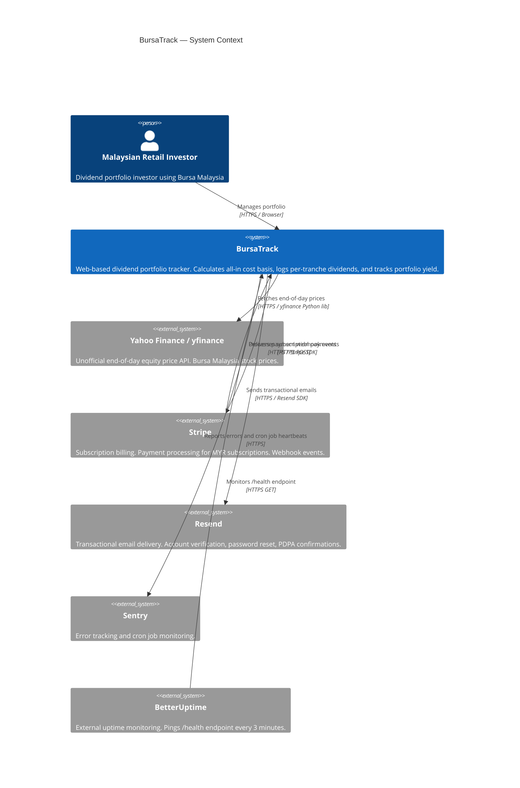

### 6.2 Deployment Context

BursaTrack is deployed across two hosting platforms:

- **Vercel** hosts the Next.js frontend. Every push to `main` triggers an automatic deployment. Every pull request branch receives an automatic preview deployment URL.
- **Render** hosts the FastAPI backend (web service), the managed PostgreSQL database, and all four cron job scripts. Deployments are triggered by push to `main` after GitHub Actions CI passes.

The two platforms are connected by the FastAPI REST API, accessed by the Next.js frontend over HTTPS.

---

## 7. High-Level Architecture

### 7.1 Component Diagram

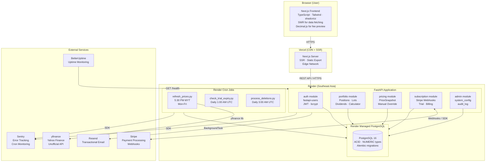

### 7.2 Internal Module Structure

The FastAPI application is a modular monolith. Each module owns its routes, service layer, and models. Cross-module access goes through service interfaces, never direct database joins across domain boundaries.

```
app/
├── main.py                    # FastAPI app factory, middleware, router registration
├── config.py                  # Pydantic BaseSettings (env vars + system_config)
├── database.py                # SQLAlchemy async engine, session factory
│
├── auth/
│   ├── models.py              # User (with token_version field)
│   ├── schemas.py             # Pydantic schemas for auth
│   ├── router.py              # Registration, login, logout, password reset
│   └── service.py             # fastapi-users integration, token_version management
│
├── portfolio/
│   ├── models.py              # Position, Lot, DividendTranche
│   ├── schemas.py
│   ├── router.py              # CRUD routes for positions, lots, dividends
│   ├── service.py             # Aggregate computation, fee engine (Python Decimal)
│   └── calculator.py          # Fee calculation engine (authoritative)
│
├── pricing/
│   ├── models.py              # PriceSnapshot, ImportJob
│   ├── schemas.py
│   ├── router.py              # Manual price override, import status polling
│   └── service.py             # PriceSnapshot write, stale detection
│
├── subscription/
│   ├── models.py              # SubscriptionRecord, ProcessedWebhookEvent
│   ├── schemas.py
│   ├── router.py              # Stripe webhook handler, subscription status
│   └── service.py             # Stripe SDK calls, account status transitions
│
├── admin/
│   ├── models.py              # SystemConfig, AuditLog
│   ├── schemas.py
│   ├── router.py              # /config/fees, /health
│   └── service.py             # Config TTLCache, audit log writes
│
└── scripts/
    ├── refresh_prices.py      # Cron: daily price refresh
    ├── check_trial_expiry.py  # Cron: trial expiry transitions
    ├── process_renewals.py    # Cron: subscription renewal
    └── process_deletions.py   # Cron: PDPA hard-delete
```

The Next.js frontend follows the same domain-aligned structure. Each domain group owns its pages, components, hooks, and API client calls. Shared UI primitives live in `components/ui` (shadcn/ui); cross-domain utilities (decimal helpers, date formatting, fee preview engine) live in `lib/`.

```
src/
├── app/                           # Next.js App Router
│   ├── layout.tsx                 # Root layout (font, Sentry, auth provider)
│   ├── page.tsx                   # Landing / marketing page
│   ├── (auth)/                    # Auth route group (no sidebar layout)
│   │   ├── login/page.tsx
│   │   ├── register/page.tsx
│   │   └── reset-password/page.tsx
│   ├── (app)/                     # Authenticated route group (sidebar layout)
│   │   ├── layout.tsx             # Sidebar, header, subscription gate
│   │   ├── dashboard/page.tsx     # Portfolio dashboard (FR-011)
│   │   ├── positions/
│   │   │   ├── page.tsx           # Position list
│   │   │   ├── new/page.tsx       # Add position form (FR-003)
│   │   │   └── [id]/
│   │   │       ├── page.tsx       # Position detail + lot list
│   │   │       ├── edit/page.tsx  # Edit position / lot (FR-005)
│   │   │       └── lots/new/page.tsx  # Add lot to existing position (FR-004)
│   │   ├── dividends/
│   │   │   ├── page.tsx           # Dividend calendar (FR-013)
│   │   │   └── [positionId]/new/page.tsx  # Log dividend tranche (FR-009)
│   │   ├── calculator/page.tsx    # Sell scenario calculator (FR-012)
│   │   ├── import/page.tsx        # CSV import (FR-014)
│   │   ├── account/
│   │   │   ├── page.tsx           # Account settings
│   │   │   ├── subscription/page.tsx  # Subscription management (FR-016)
│   │   │   └── delete/page.tsx    # Account deletion flow (FR-019)
│   │   └── paywall/page.tsx       # Trial expired / upgrade prompt
│   └── api/                       # Next.js API routes (thin proxies only)
│       └── auth/[...nextauth]/    # Cookie passthrough if needed
│
├── components/
│   ├── ui/                        # shadcn/ui primitives (Button, Input, Table…)
│   ├── portfolio/
│   │   ├── PositionTable.tsx      # Dashboard position list with stale indicators
│   │   ├── LotForm.tsx            # Add/edit lot form with live fee preview
│   │   ├── FeeBreakdown.tsx       # Brokerage + clearing + stamp duty display
│   │   └── StaleDataBanner.tsx    # Price staleness alert
│   ├── dividends/
│   │   ├── DividendForm.tsx       # Log/edit dividend tranche
│   │   ├── DividendCalendar.tsx   # Calendar view (FR-013)
│   │   └── YieldSummary.tsx       # All-in yield display
│   ├── calculator/
│   │   └── SellCalculator.tsx     # Sell scenario calculator (client-side Decimal)
│   ├── subscription/
│   │   ├── SubscriptionGate.tsx   # Wraps protected content; redirects to paywall
│   │   └── BillingStatus.tsx      # Current plan + renewal date display
│   └── shared/
│       ├── StockAutocomplete.tsx  # Stock code lookup (calls /api/v1/stocks)
│       ├── ConfirmDialog.tsx      # Reusable delete confirmation modal
│       └── ImportStatusPoller.tsx # Polls /import/status/{job_id} every 2s
│
├── hooks/
│   ├── usePortfolio.ts            # SWR: GET /api/v1/portfolio/dashboard
│   ├── usePosition.ts             # SWR: GET /api/v1/portfolio/positions/{id}
│   ├── useDividends.ts            # SWR: GET /api/v1/portfolio/dividends
│   ├── useSubscription.ts         # SWR: GET /api/v1/subscription/status
│   └── useStocks.ts               # SWR: GET /api/v1/stocks (cached 1h TTL)
│
└── lib/
    ├── api.ts                     # Typed fetch wrapper; injects credentials: include
    ├── fees.ts                    # Client-side fee preview engine (decimal.js)
    ├── decimal.ts                 # Shared Decimal formatting helpers
    ├── dates.ts                   # MYT-aware date utilities
    └── constants.ts               # API base URL, stale threshold (28h)
```

---

## 8. System Components

### 8.1 Next.js Frontend

**Responsibility:** Render the user interface; provide live fee preview via client-side calculation; fetch and display portfolio data using SWR; handle authentication via HTTP-only cookie.

**Key characteristics:**

- TypeScript throughout; strict mode enabled
- shadcn/ui component library (Radix UI primitives + Tailwind CSS)
- SWR for all server data fetching: stale-while-revalidate with window-focus revalidation
- `decimal.js` for client-side fee preview calculations (matching server precision)
- No localStorage or sessionStorage — all state in React and SWR cache
- Responsive design from 375px viewport width

**Interfaces:**

- Renders HTML to user browser via Vercel CDN/SSR
- Calls FastAPI REST API over HTTPS (`/api/v1/*`)
- Reads JWT from HTTP-only cookie (set by FastAPI on login)

**Dependencies:** Vercel for hosting, FastAPI for all data

**Failure modes:**

- Vercel deployment failure: Vercel keeps the previous deployment active; one-click rollback available
- FastAPI API unavailable: SWR shows stale cached data; API error toasts displayed to user
- yfinance stale: frontend renders stale price indicator based on `last_refreshed_at` timestamp returned in API responses

---

### 8.2 FastAPI Backend

**Responsibility:** Authoritative REST API for all data operations; server-side fee calculation; JWT authentication; Stripe webhook processing; email delivery via BackgroundTasks; CSV import processing.

**Key characteristics:**

- Python 3.13; async-first (async SQLAlchemy, async route handlers)
- Pydantic v2 for request/response validation and settings management
- `Decimal` (Python standard library) for all monetary calculations — no `float` usage permitted
- `fastapi-users` for authentication flows
- `slowapi` for rate limiting (per-IP on auth endpoints; per-user on import)
- `structlog` for structured JSON logging to stdout
- Sentry SDK initialised at startup

**Interfaces:**

- HTTP/HTTPS REST API consumed by Next.js frontend
- Receives Stripe webhooks via `POST /webhooks/stripe`
- Calls yfinance (from cron scripts only, not from web request path)
- Calls Resend API via BackgroundTasks
- Reads/writes PostgreSQL via async SQLAlchemy

**Dependencies:** PostgreSQL (primary data store), Resend (email), Stripe (webhooks), Sentry

**Failure modes:**

- PostgreSQL unreachable: `GET /health` returns HTTP 503; BetterUptime alerts within 3 minutes; all API requests fail with 503 until recovery
- Resend unavailable: email BackgroundTask retries once; Sentry captures final failure; UI shows "Resend email" button for critical flows
- Render service crash: Render restarts the service automatically; in-flight BackgroundTasks are lost (CSV imports in `processing` state remain stale — user must re-upload)

---

### 8.3 PostgreSQL Database

**Responsibility:** Durable, ACID-compliant storage for all application data.

**Key characteristics:**

- All monetary values stored as `NUMERIC` with appropriate precision (never `FLOAT` or `DOUBLE`)
- UUID primary keys on all tables
- Soft-delete pattern (`is_deleted BOOLEAN`, `deleted_at TIMESTAMPTZ`) on `Position`, `Lot`, `DividendTranche`
- `version INTEGER` column on `Lot` and `DividendTranche` for optimistic locking
- Alembic manages all schema migrations; backwards-compatible migrations only
- Managed by Render (automated daily backups, connection pooling via PgBouncer available)

**Key indexes required:**

- `lots(position_id, is_deleted)` — dashboard aggregate queries
- `dividend_tranches(position_id, year, is_deleted)` — YTD dividend sum
- `price_snapshots(stock_code, trading_date)` — price lookups
- `audit_log(user_id)` — PDPA deletion job
- `audit_log(entity_type, entity_id)` — drill-down queries
- `import_jobs(user_id, status)` — import status polling
- `processed_webhook_events(event_id)` — idempotency check (primary key)

**Failure modes:**

- Connection pool exhaustion: enable Render PgBouncer (transaction mode); SQLAlchemy pool returns connection errors; monitored via Render dashboard metrics
- Disk full: Render sends alerts; managed service handles storage auto-scaling on paid plans
- Backup needed: Render automated daily snapshot; RTO ≤ 4 hours; RPO ≤ 24 hours

---

### 8.4 Render Cron Jobs

**Responsibility:** Execute four scheduled background scripts at defined intervals. Each script is an independent Python process that imports the FastAPI application's service layer.

| Script                  | Schedule (UTC) | Purpose                                          |
| ----------------------- | -------------- | ------------------------------------------------ |
| `refresh_prices.py`     | `30 9 * * 1-5` | Daily price refresh (5:30 PM MYT, Mon-Fri)       |
| `check_trial_expiry.py` | `0 1 * * *`    | Transition trial accounts to `trial_expired`     |
| `process_deletions.py`  | `0 3 * * *`    | PDPA hard-delete for accounts past deletion date |

> **Note:** The `process_renewals.py` cron job previously described in this document has been removed (CRIT-R-003). Subscription renewal is handled entirely by Stripe's native billing engine. See §13.4 for the full decision record.

**Interfaces:** Read/write PostgreSQL; `refresh_prices.py` calls yfinance; all scripts report to Sentry Cron Monitoring

**Failure modes:** Render marks the cron run as failed; Sentry Cron Monitoring fires an alert if a scheduled check-in is missed; each script is wrapped in try/except with `sentry_sdk.capture_exception`

---

### 8.5 External Services

| Service          | Purpose                                | Failure impact                                                                      |
| ---------------- | -------------------------------------- | ----------------------------------------------------------------------------------- |
| **yfinance**     | End-of-day Bursa price data            | Stale prices; stale-data banner shown; manual override available                    |
| **Stripe**       | Subscription billing; webhook delivery | Webhook retry for up to 3 days; idempotency prevents double-processing              |
| **Resend**       | Transactional email                    | 1 in-task retry; Sentry alert on final failure; UI resend button for critical flows |
| **Sentry**       | Error tracking; cron monitoring        | Loss of error visibility; no product impact                                         |
| **BetterUptime** | Uptime monitoring                      | Loss of downtime alerting; no product impact                                        |

---

## 9. Data Flow

### 9.1 Primary Read Path (Dashboard Load)

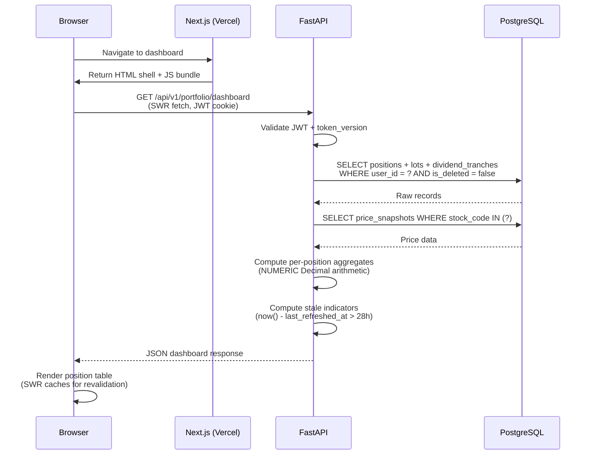

### 9.2 Write Path (Add Position)

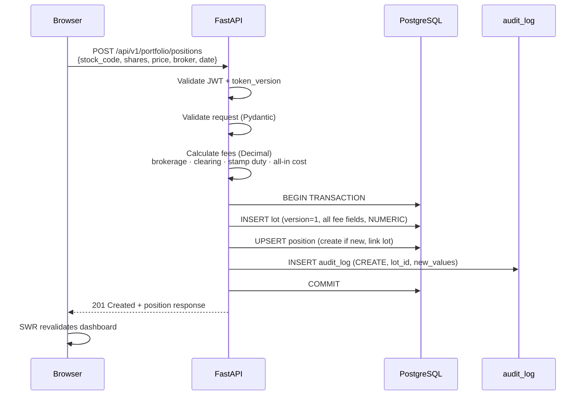

### 9.3 Daily Price Refresh Data Flow

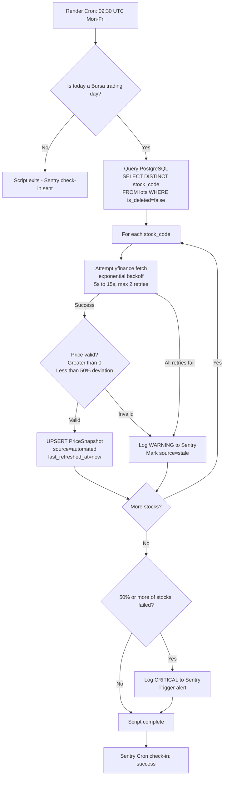

---

## 10. Key Workflows

### 10.1 User Registration and Email Verification

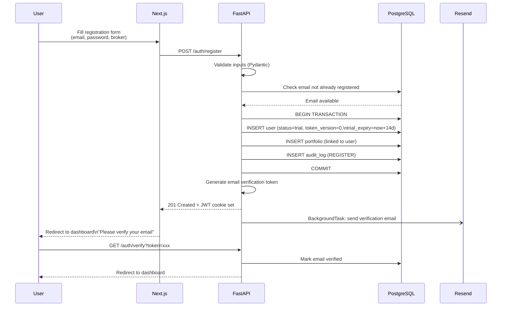

### 10.2 Log Dividend Tranche (qualifying_shares Invariant)

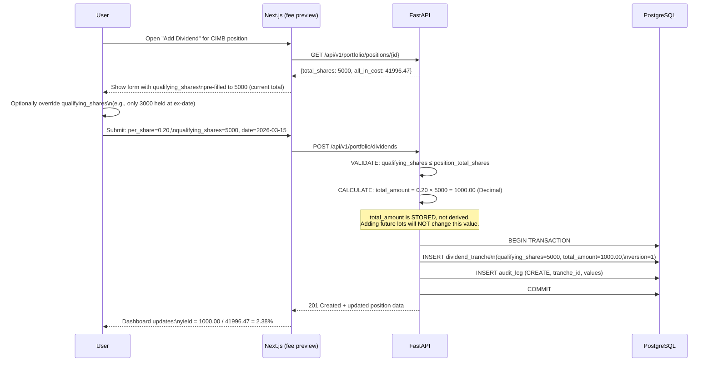

### 10.3 CSV Import Processing (OTQ-007)

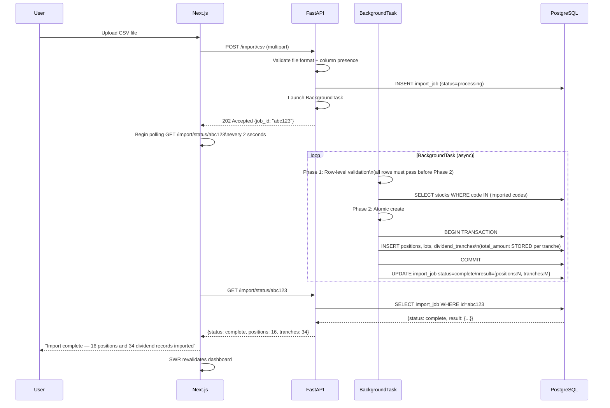

### 10.4 Subscription Lifecycle (Stripe Webhook)

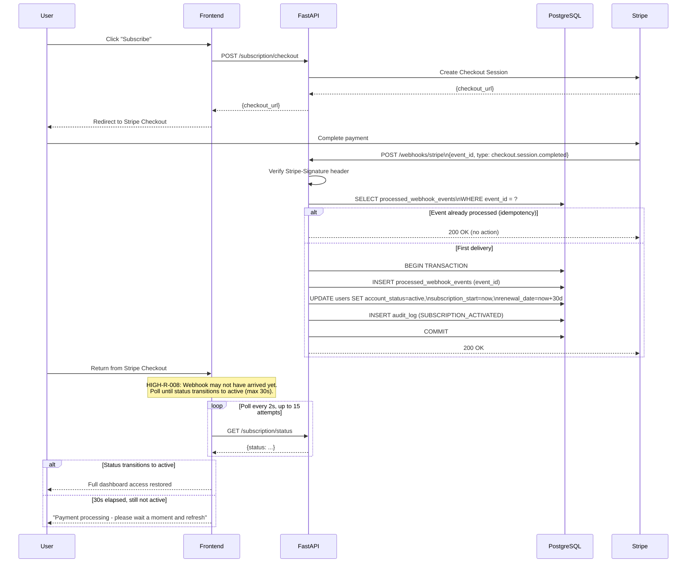

### 10.5 PDPA Account Deletion Workflow

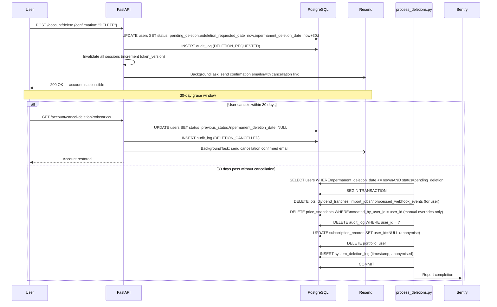

### 10.6 BrokerConfig Management (HIGH-R-012)

`BrokerConfig` is a first-class entity linked from every `Lot`. The following specifies its seeding, user management, and deletion behaviour.

**System-seeded broker configs (deployed at first migration):**

| name                    | fee_type    | rate      | minimum_fee | flat_fee | is_system |
| ----------------------- | ----------- | --------- | ----------- | -------- | --------- |
| Maybank IB              | percentage  | 0.007000  | 8.00        | null     | true      |
| CIMB Clicks             | percentage  | 0.007000  | 8.00        | null     | true      |
| RHB Reflex              | percentage  | 0.007000  | 8.00        | null     | true      |
| Rakuten Trade           | percentage  | 0.007000  | 7.00        | null     | true      |
| Mirae Asset             | percentage  | 0.004200  | 8.00        | null     | true      |
| M+ Online               | percentage  | 0.006000  | 8.00        | null     | true      |

System broker configs have `is_system=true` and `created_by_user_id=NULL`. They cannot be deleted or modified by users.

**API endpoints for custom broker configs:**

| Method | Endpoint | Description |
| ------ | -------- | ----------- |
| `GET` | `/api/v1/brokers` | List system configs + user's custom configs |
| `POST` | `/api/v1/brokers` | Create custom broker config |
| `PATCH` | `/api/v1/brokers/{id}` | Update custom broker config (own only) |
| `DELETE` | `/api/v1/brokers/{id}` | Delete custom config (own only; blocked if referenced by lots) |

**FK deletion constraint:** If a user attempts to delete a custom `BrokerConfig` that is referenced by one or more `Lot` records, the API returns HTTP 409 Conflict: `{"error": "in_use", "message": "This broker config is used by existing lots and cannot be deleted."}` The user must reassign or delete the lots first.

**Relationship with `system_config`:** `BrokerConfig.rate` and `minimum_fee` store the fee values at configuration time. Clearing fee and stamp duty rates are not stored in `BrokerConfig` — they are always read from `system_config` at calculation time. This ensures that changes to clearing fee or stamp duty parameters in `system_config` are automatically reflected in all future fee calculations without requiring updates to individual `BrokerConfig` records.

**G-001 compliance:** All fee calculations that reference a `BrokerConfig` use the authoritative server-side calculator in `portfolio/calculator.py`. No client-side calculation may persist fee values directly — the frontend fee preview is display-only.

---

### 10.7 PDPA Data Export Workflow (FR-018)

> **CRIT-R-002 Resolution:** FR-018 is a legal obligation under Malaysian PDPA. The following specifies its full implementation.

**Export scope:** All personal and financial data associated with the authenticated user, assembled into a single JSON file.

| Entity exported | Fields included |
| --------------- | --------------- |
| `User` | email, account_status, trial_expiry_date, subscription_start_date, created_at |
| `Portfolio` | id, created_at |
| `Position` | stock_code, stock_name, category_tag, is_deleted, created_at |
| `Lot` | shares, purchase_price, all_in_cost (and all fee fields), purchase_date, broker_name, created_at |
| `DividendTranche` | tranche_label, per_share_amount, qualifying_shares, total_amount, year, payment_date, ex_dividend_date, created_at |
| `BrokerConfig` (custom only) | name, fee_type, rate, minimum_fee, flat_fee |
| `ImportJob` | status, result_payload, created_at |
| `AuditLog` | action, entity_type, entity_id, created_at (metadata excluded — may contain IP) |

Fields excluded from the export: `password_hash`, `token_version`, all internal FKs, all `is_deleted` / `deleted_at` soft-delete markers (soft-deleted records are excluded from the export).

**Format:** Single JSON file. Filename: `bursatrack-export-{date}.json`.

**Delivery:** Synchronous on-demand download. The endpoint generates the JSON in-memory and streams it as a file download response. No async job required at V1 data volumes (< 50 positions × 8 tranches per user = ~400 records maximum).

**Sequence:**

```mermaid
sequenceDiagram
    participant User
    participant Frontend as Next.js
    participant API as FastAPI
    participant DB as PostgreSQL

    User->>Frontend: Click "Download My Data" (Account Settings)
    Frontend->>API: GET /api/v1/account/export
    API->>API: Validate JWT + token_version
    API->>DB: SELECT all user entities (portfolio, positions, lots,<br/>dividend_tranches, broker_configs, import_jobs, audit_log)
    DB-->>API: All records
    API->>API: Assemble JSON export object<br/>Exclude: password_hash, soft-deleted records, internal FKs
    API->>DB: INSERT audit_log (DATA_EXPORT_DOWNLOADED)
    API-->>Frontend: StreamingResponse<br/>Content-Type: application/json<br/>Content-Disposition: attachment; filename=bursatrack-export-{date}.json
    Frontend-->>User: Browser downloads file
```

**Rate limiting:** Export endpoint is subject to the standard authenticated endpoint limit (60/minute). No additional restriction is required at V1 volumes.

**PDPA note:** The export endpoint provides the user with access to all personal data held by the system, satisfying the right of access under Malaysian PDPA Section 30. The export excludes derived market data (PriceSnapshot) as this is shared system data, not personal data.

---

## 11. Integration Architecture

### 11.1 yfinance (Market Data)

| Attribute            | Detail                                                                                                                                                                                |
| -------------------- | ------------------------------------------------------------------------------------------------------------------------------------------------------------------------------------- |
| **Purpose**          | Sole source of end-of-day Bursa Malaysia equity prices                                                                                                                                |
| **Invocation**       | From `scripts/refresh_prices.py` cron script only; never from the web request path                                                                                                    |
| **Authentication**   | None (unofficial scraper; no API key required)                                                                                                                                        |
| **Retry strategy**   | Per-stock: up to 2 retries with exponential backoff (5s, 15s). Each stock is independent — a failure on one stock does not abort others.                                              |
| **Failure handling** | Failed stocks: mark `PriceSnapshot.source = stale`. If >50% of stocks fail: Sentry CRITICAL alert. Stale-data banner shown to users for holdings with `last_refreshed_at > 28 hours`. |
| **Fallback**         | None automated for V1. Manual price override available as user-facing fallback.                                                                                                       |
| **Rate limiting**    | Undocumented by Yahoo Finance. Mitigation: sequential per-stock fetches with backoff delays prevent burst patterns.                                                                   |
| **Timeout**          | 30 seconds per stock fetch (yfinance library default).                                                                                                                                |
| **SLA**              | None. Unofficial API. Outage is a first-class operational event.                                                                                                                      |
| **Abstraction**      | Price fetching is isolated in `pricing/service.py` behind a `PriceProvider` interface. Substituting yfinance requires only changing the concrete implementation.                      |

### 11.2 Stripe (Payment Processing)

| Attribute                 | Detail                                                                                                                                                                                                                                                                    |
| ------------------------- | ------------------------------------------------------------------------------------------------------------------------------------------------------------------------------------------------------------------------------------------------------------------------- |
| **Purpose**               | Subscription billing, trial-to-paid conversion, renewal, cancellation, dunning                                                                                                                                                                                            |
| **Authentication**        | Stripe Secret Key (server-side, from Render env var); Stripe-Signature header verification on all incoming webhooks                                                                                                                                                       |
| **Webhook endpoint**      | `POST /webhooks/stripe`                                                                                                                                                                                                                                                   |
| **Idempotency (OTQ-008)** | Each Stripe webhook event carries a unique `event.id`. Before processing, the handler checks `processed_webhook_events` table for the `event_id`. If found: return 200 immediately without processing. If not: process and insert the `event_id` in the same transaction. |
| **Events handled**        | `checkout.session.completed` (activate), `invoice.payment_succeeded` (renewal confirmed + update `subscription_renewal_date` from `current_period_end`), `invoice.payment_failed` (set `grace_period`), `customer.subscription.deleted` (revoke access)                   |
| **Renewal model**         | Stripe-native (`collection_method=charge_automatically`). No custom cron job. All lifecycle transitions driven by webhook events. (CRIT-R-003)                                                                                                                             |
| **Failure handling**      | Stripe retries failed webhook deliveries for up to 3 days with exponential backoff. Webhook handler returns 200 for all processed events (including idempotent re-deliveries) and 500 only for unrecoverable errors (database down).                                      |
| **Timeout**               | Webhook handler must respond within 30 seconds (Stripe requirement).                                                                                                                                                                                                      |
| **Currency**              | MYR (Malaysian Ringgit)                                                                                                                                                                                                                                                   |
| **Limitations**           | No FPX (Malaysian online banking transfer) support. V2 consideration.                                                                                                                                                                                                     |

### 11.3 Resend (Transactional Email)

| Attribute            | Detail                                                                                                                                                                                        |
| -------------------- | --------------------------------------------------------------------------------------------------------------------------------------------------------------------------------------------- |
| **Purpose**          | Account verification, password reset, PDPA deletion confirmation/cancellation, subscription confirmation                                                                                      |
| **Authentication**   | Resend API Key (from Render env var)                                                                                                                                                          |
| **Invocation**       | FastAPI `BackgroundTasks` — fire-and-forget after HTTP response is sent                                                                                                                       |
| **Retry strategy**   | 1 in-task retry on API error. On final failure: `sentry_sdk.capture_exception`.                                                                                                               |
| **Failure handling** | Email failures do not block user flows. For critical flows (email verification, password reset), the UI shows a "Resend email" button. For PDPA deletion confirmation, Sentry alert is fired. |
| **Templates**        | Jinja2 HTML templates co-located in the FastAPI app (`app/templates/email/*.html`). The BackgroundTask renders templates server-side via `jinja2` and passes rendered HTML to the Resend SDK. React Email (a Next.js pattern) is not used — it would require a server-to-server call from FastAPI to Next.js. (Resolves AS-002.) |
| **Volume**           | Transactional only; no bulk marketing. Free tier (3,000 emails/month) is sufficient for V1.                                                                                                   |
| **Rate limiting**    | Not applicable at V1 volumes                                                                                                                                                                  |
| **Timeout**          | 10 seconds per API call                                                                                                                                                                       |

---

## 12. Data Architecture

### 12.1 Core Entity Model

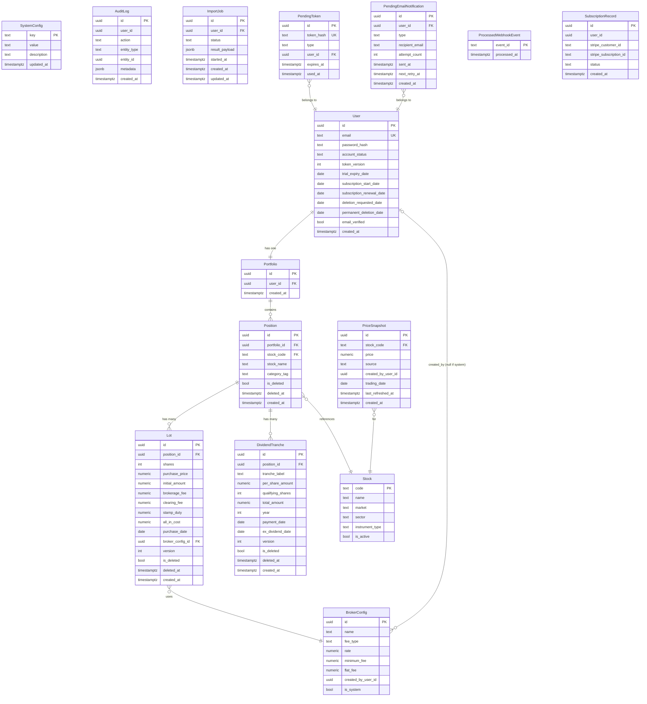

### 12.2 Data Ownership and Sensitivity

| Entity                      | Owner              | PII?                         | PDPA delete action                                           |
| --------------------------- | ------------------ | ---------------------------- | ------------------------------------------------------------ |
| `User`                      | Per-user           | Yes (email, password_hash)   | Hard delete                                                  |
| `Portfolio`                 | Per-user           | No                           | Hard delete (cascade)                                        |
| `Position`                  | Per-user           | No                           | Hard delete                                                  |
| `Lot`                       | Per-user           | Financial data               | Hard delete                                                  |
| `DividendTranche`           | Per-user           | Financial data               | Hard delete                                                  |
| `PriceSnapshot` (automated) | Shared (all users) | No                           | **Retain** — shared market data                              |
| `PriceSnapshot` (manual)    | Per-user           | No                           | Hard delete (`created_by_user_id` = user)                    |
| `AuditLog`                  | Per-user           | Potentially (IP in metadata) | Hard delete                                                  |
| `ImportJob`                 | Per-user           | No                           | Hard delete                                                  |
| `SubscriptionRecord`        | Per-user           | No                           | **Anonymise** — null `user_id`; retain for 7-year accounting |
| `ProcessedWebhookEvent`     | Per-user           | No                           | Hard delete                                                  |
| `BrokerConfig` (custom)             | Per-user           | No                           | Hard delete                                                  |
| `BrokerConfig` (system)             | System             | No                           | Retain                                                       |
| `PendingToken`                      | Per-user           | No                           | Hard delete (ON DELETE CASCADE from User)                    |
| `PendingEmailNotification`          | Per-user           | Email address                | Hard delete                                                  |
| `Stock`                             | System             | No                           | Retain                                                       |
| `SystemConfig`                      | System             | No                           | Retain                                                       |

### 12.3 Data Precision Rules

All monetary amounts use exact decimal arithmetic throughout the stack.

| Field                                            | PostgreSQL type | Python type | TypeScript type        |
| ------------------------------------------------ | --------------- | ----------- | ---------------------- |
| Purchase price per share                         | `NUMERIC(12,4)` | `Decimal`   | `Decimal` (decimal.js) |
| Fee amounts (brokerage, clearing, stamp, all-in) | `NUMERIC(14,2)` | `Decimal`   | `Decimal`              |
| Dividend per share                               | `NUMERIC(12,6)` | `Decimal`   | `Decimal`              |
| DividendTranche total_amount                     | `NUMERIC(14,2)` | `Decimal`   | `Decimal`              |
| PriceSnapshot price                              | `NUMERIC(12,4)` | `Decimal`   | `Decimal`              |
| BrokerConfig rate                                | `NUMERIC(10,6)` | `Decimal`   | N/A (server-side only) |

> **HIGH-R-006:** Yield percentage is **computed at query time** in the API layer, consistent with ADR-004 ("position aggregates computed at query time"). No `yield_percentage` column is stored in any table. The formula `total_dividend_income / total_all_in_cost` is always derived on the fly from stored `DividendTranche.total_amount` and `Lot.all_in_cost` values.

### 12.4 Caching Strategy

| Data                               | Cache location                     | TTL                    | Invalidation                                         |
| ---------------------------------- | ---------------------------------- | ---------------------- | ---------------------------------------------------- |
| Stock reference list (`/stocks`)   | FastAPI in-process `TTLCache`      | 60 minutes             | TTL expiry only (rate of change: ~weekly)            |
| Fee configuration (`/config/fees`) | FastAPI in-process `TTLCache`      | 60 minutes             | TTL expiry; updated via admin endpoint               |
| Portfolio dashboard data           | Browser SWR cache                  | Stale-while-revalidate | Window focus; manual revalidation on write mutations |
| Position detail data               | Browser SWR cache                  | Stale-while-revalidate | Window focus; after add/edit/delete operations       |
| Price snapshots                    | PostgreSQL `price_snapshots` table | N/A (DB is the cache)  | Overwritten by daily cron refresh                    |

Redis is not used at any layer. (ADR-008)

> **MED-R-003 — Cache cold start:** The `TTLCache` is in-process and resets on every Render deployment or service restart. To reduce the database burst immediately after deployment, the FastAPI `lifespan` startup handler proactively warms both caches before the first request is served:
> ```python
> @asynccontextmanager
> async def lifespan(app: FastAPI):
>     await warm_stock_reference_cache()
>     await warm_fee_config_cache()
>     yield
> ```
> This is a low-effort mitigation that eliminates the cold-start spike for stock reference and fee config queries.

### 12.5 Data Lifecycle

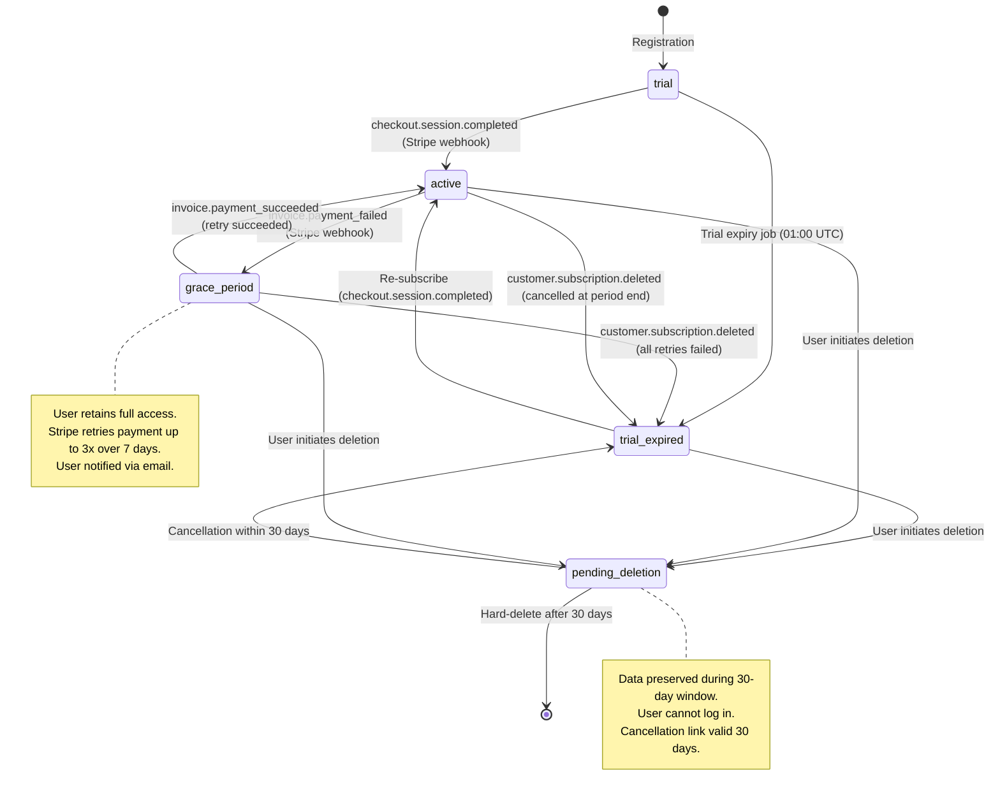

---

## 13. Background Processing

### 13.1 Scheduled Jobs Overview

All scheduled jobs are standalone Python scripts invoked by Render's native cron scheduler. Each script:

1. Initialises the SQLAlchemy async engine using the same database URL as the FastAPI app
2. Reports a Sentry Cron Monitoring check-in at completion
3. Wraps the entire execution in try/except; captures exceptions to Sentry

```mermaid
gantt
    title Daily Background Job Schedule (UTC)
    dateFormat HH:mm
    axisFormat %H:%M

    section Trading Day Jobs
    Price Refresh (Mon-Fri only)     : 09:30, 15m

    section Daily Maintenance Jobs
    Trial Expiry Check               : 01:00, 2m
    PDPA Hard-Delete                 : 03:00, 5m
```

### 13.2 Price Refresh Job (`refresh_prices.py`)

**Schedule:** `30 9 * * 1-5` (09:30 UTC = 5:30 PM MYT, Mon-Fri)

**Algorithm:**

1. **Process lock (HIGH-R-004):** Check `system_config` for a `price_refresh_lock` key. If set to a timestamp within the past 2 hours, log WARNING and exit — a previous run is still in progress. Otherwise, set `price_refresh_lock = now()` and proceed. Clear the lock on normal exit or exception.

2. **Wall-clock timeout (HIGH-R-004):** The entire job is wrapped with a 60-minute `asyncio.wait_for` timeout. If the timeout fires, the lock is cleared, remaining stocks are marked stale, and Sentry CRITICAL is fired.

3. Load Bursa Malaysia holiday calendar from `system_config` key `bursa_holidays` (JSON array of ISO date strings, e.g., `["2026-01-01", "2026-01-29"]`). If today is a holiday, exit with Sentry check-in.

4. Query: `SELECT DISTINCT l.stock_code FROM lots l JOIN positions p ON l.position_id = p.id WHERE l.is_deleted=false AND p.is_deleted=false`

5. **Parallel fetch with concurrency limit (HIGH-R-004):** Use `asyncio.gather` with a semaphore (max 10 concurrent fetches) to parallelise yfinance calls. This bounds the total fetch window to approximately `ceil(unique_codes / 10) * worst_case_per_stock` rather than sequential `N * worst_case`.

6. For each `stock_code` (in parallel):
   a. Fetch via yfinance with 2 retries (5s, 15s backoff)
   b. On success: validate price using configurable threshold from `system_config` key `price_deviation_max_pct` (default: `75`, representing 75%)
   c. If price deviation exceeds threshold: log `CORPORATE_ACTION_CANDIDATE` WARNING with specific values; mark `source=stale` — do NOT trigger stale banner; manual review by admin required
   d. On valid: `UPSERT price_snapshots (stock_code, trading_date=today, price, source=automated, last_refreshed_at=now())`
   e. On all retries fail: log WARNING to Sentry; mark `source=stale`

7. Count failed stocks. If >50% failed: log CRITICAL to Sentry.
8. Clear process lock.
9. Send Sentry Cron check-in.

**Price deviation threshold (MED-R-006):** The deviation guard is configurable via `system_config.price_deviation_max_pct`. Default is 75 (75%), not 50%, to accommodate legitimate corporate-action price movements (rights issues, bonus shares, suspension resumptions). When a price is rejected by the guard, the structlog entry includes `{"event": "price_deviation_guard", "stock_code": "1234", "previous_price": "1.50", "new_price": "0.30", "deviation_pct": "80", "action": "CORPORATE_ACTION_CANDIDATE"}` for admin investigation.

**Holiday calendar maintenance (MED-R-004):** The Bursa Malaysia holiday calendar is maintained via `PATCH /admin/config` with key `bursa_holidays`. The admin must update this value before each new calendar year. If the calendar does not contain any dates for the current year, the script logs a WARNING: `"Holiday calendar may be stale — no entries for {year}"`.

**Stale detection on frontend:**  
API responses for positions include `last_refreshed_at` from the latest `PriceSnapshot`. Next.js computes `isStale = (Date.now() - lastRefreshedAt) > 28 * 60 * 60 * 1000` and renders a stale indicator per position.

### 13.3 Trial Expiry Job (`check_trial_expiry.py`)

**Schedule:** `0 1 * * *` (01:00 UTC daily)

**Algorithm:**

1. `UPDATE users SET account_status='trial_expired' WHERE account_status='trial' AND trial_expiry_date <= CURRENT_DATE`
2. Log count of affected rows.
3. Send Sentry Cron check-in.

**Idempotency:** The UPDATE only targets accounts in `trial` status; re-running on the same day is safe.

### 13.4 Subscription Renewal — Stripe-Native Billing

> **CRIT-R-003 Resolution:** The previously described `process_renewals.py` cron job has been removed. A custom cron job that calls `stripe.invoice.create` on the same day Stripe attempts automatic renewal creates an unavoidable double-charge risk. The definitive architectural decision is to rely entirely on Stripe's built-in subscription billing engine.

**Decision:** Stripe subscriptions are created with `collection_method=charge_automatically`. Stripe handles all renewal attempts, dunning (retry on failed payment), and grace period management internally.

**Webhook-driven lifecycle:** All subscription state changes are driven by Stripe webhook events processed by `POST /webhooks/stripe`:

| Stripe event                    | Application action                                                                         |
| ------------------------------- | ------------------------------------------------------------------------------------------ |
| `checkout.session.completed`    | Set `account_status=active`; store `subscription_start_date`; update `renewal_date` from `subscription.current_period_end` |
| `invoice.payment_succeeded`     | Confirm active status; update `subscription_renewal_date` from `subscription.current_period_end` |
| `invoice.payment_failed`        | Set `account_status=grace_period`; Sentry alert; user notified via email BackgroundTask    |
| `customer.subscription.deleted` | Set `account_status=trial_expired`; user retains access until end of paid period if cancelled at period end |

**Grace period:** Stripe retries failed payments on a configurable schedule (default: 3 attempts over 7 days). During this window, `account_status=grace_period` is set — the user retains full access. If all retries fail, `customer.subscription.deleted` fires and access is revoked.

**`subscription_renewal_date` accuracy:** On every `invoice.payment_succeeded` event, `User.subscription_renewal_date` is updated from `invoice.subscription.current_period_end` (not by adding 30 days). This ensures the stored date stays in sync with Stripe's actual billing date regardless of proration, retries, or manual adjustments. (Resolves LOW-R-005.)

### 13.5 PDPA Hard-Delete Job (`process_deletions.py`)

**Schedule:** `0 3 * * *` (03:00 UTC daily)

**Algorithm:**

1. `SELECT id FROM users WHERE account_status='pending_deletion' AND permanent_deletion_date <= CURRENT_DATE`
2. For each user_id:

   **Pre-deletion gate (MED-R-005):** Before deleting any data, verify that the PDPA deletion confirmation email was delivered by checking `pending_email_notifications WHERE type='PDPA_DELETION_CONFIRMED' AND user_id=? AND sent_at IS NOT NULL`. If the confirmation email was never delivered, log a Sentry CRITICAL alert and skip this user's deletion. A manually remediated resend is required before the deletion proceeds. This prevents legally required notifications from being silently lost.

   **Stripe subscription cancellation (MS-002):** If `subscription_records.stripe_subscription_id IS NOT NULL`, cancel the Stripe subscription via `stripe.Subscription.cancel(stripe_subscription_id, cancel_at_period_end=False)` before deleting user data. This prevents Stripe from attempting renewal against a non-existent customer.

   **Atomic deletion (HIGH-R-007):** The `users` table `audit_log` FK is defined as `ON DELETE CASCADE`. Deleting the `users` row therefore automatically removes all `audit_log` rows for that user — no explicit `DELETE audit_log WHERE user_id = ?` is required. The deletion order within the transaction is:

   a. `BEGIN TRANSACTION`
   b. Delete: `lot_price_overrides` (manual price_snapshots where `created_by_user_id = user_id`)
   c. Delete: `import_jobs` (for user)
   d. Delete: `processed_webhook_events` (for user)
   e. Delete: `pending_email_notifications` (for user)
   f. Delete: `dividend_tranches` (for user's positions)
   g. Delete: `lots` (for user's positions)
   h. Delete: `positions` (for user's portfolio)
   i. Delete: `portfolio` (for user)
   j. Update: `subscription_records SET user_id=NULL` (anonymise; retain for 7-year accounting)
   k. Insert: `system_deletion_log` (timestamp + anonymised reason; no PII) — must occur before user delete
   l. Delete: `users` (CASCADE removes audit_log rows automatically)
   m. `COMMIT`

3. Log count of deleted accounts to structlog.
4. Capture any per-user exceptions to Sentry without aborting other deletions.
5. Send Sentry Cron check-in.

**Safety guard:** The `permanent_deletion_date <= CURRENT_DATE` condition ensures the 30-day window is respected. The job reads this date from the database — it is never computed from the cron schedule.

**Idempotency (MED-R-007):** The deletion job is safe to re-run for a user who was partially deleted in a previous failed run. All deletion steps use standard `DELETE WHERE` semantics — deleting a row that does not exist is a no-op in PostgreSQL. The Stripe cancellation call is idempotent (cancelling an already-cancelled subscription returns an error that is caught and logged, not re-raised). The pre-deletion gate re-checks the `permanent_deletion_date` condition, ensuring a re-run only proceeds if the date has genuinely passed.

### 13.6 Asynchronous Task Processing (BackgroundTasks)

FastAPI `BackgroundTasks` handles two async task types:

**Email delivery:**

```python
async def send_email_task(to: str, template: str, data: dict):
    for attempt in range(2):
        try:
            await resend_client.emails.send(...)
            return
        except Exception as e:
            if attempt == 1:
                sentry_sdk.capture_exception(e)
```

**CSV import:**

**Pre-accept validation (HIGH-R-009):** Applied synchronously before the BackgroundTask is launched:

1. `Content-Length` check: reject files > 1 MB with HTTP 413
2. File must have `Content-Type: text/csv` or `application/csv`
3. UTF-8 encoding validation: decode the entire file; reject with HTTP 400 if encoding errors are found
4. Row count check: reject CSVs exceeding 1,000 data rows with HTTP 400
5. CSV injection defence: on CSV template download (FR-015) and data export (FR-018), strip or quote cell values beginning with `=`, `+`, `-`, `@` to prevent formula injection when opened in Excel

**Import flow (HIGH-R-005):**

1. File received via `POST /import/csv` (multipart); pre-accept validation applied
2. Written to `tempfile.NamedTemporaryFile`
3. `ImportJob` row created: `status=processing`, `started_at=now()`
4. BackgroundTask launched; request returns `{job_id}` with HTTP 202
5. BackgroundTask: Phase 1 (row validation, stock code lookup) → Phase 2 (atomic INSERT transaction) → update `ImportJob` to `complete` or `failed` with `result_payload`
6. Client polls `GET /import/status/{job_id}` every 2 seconds
7. Temp file deleted on task completion or error

**Stuck ImportJob cleanup (HIGH-R-005):** The `check_trial_expiry.py` daily job includes a cleanup step:

```python
# Mark stuck import jobs as failed (service crash during processing)
await db.execute(
    text("""
        UPDATE import_jobs
        SET status = 'failed',
            result_payload = '{"error": "Import timed out. Please re-upload your file."}'
        WHERE status = 'processing'
          AND started_at < now() - interval '1 hour'
    """)
)
```

The status polling response for a failed job returns a clear CTA: `{"status": "failed", "error": "Import timed out. Please re-upload your file.", "retry": true}`.

---

## 14. Security Architecture

### 14.1 Authentication

**Library:** fastapi-users (provides registration, login, logout, password reset, email verification)

**Token signing algorithm (HIGH-R-002):** RS256 (RSA-SHA256) asymmetric signing.

- The private RSA key signs tokens and is held exclusively by the FastAPI API server (stored as `JWT_PRIVATE_KEY` Render environment variable, PEM-encoded).
- The public key verifies tokens. It can be safely distributed (published at `GET /auth/jwks.json`) but in practice is only used server-side.
- Key rotation does not immediately invalidate existing sessions — tokens signed with a rotated private key are no longer verifiable, which forces re-authentication. A planned key rotation must be communicated 24 hours in advance.
- `fastapi-users` supports RS256 via the `JWTStrategy` with an RSA key pair.

**Token mechanism:**

- JWT signed with RS256; payload includes: `user_id`, `token_version`, `exp` (7-day expiry)
- Stored in HTTP-only, Secure, SameSite=Lax cookie — not accessible to JavaScript
- **Token revocation:** Each `User` record has a `token_version INTEGER` column. On JWT validation, the middleware checks `jwt.token_version == user.token_version`. If mismatched, the request is rejected as 401. `token_version` is incremented on: logout, password change, account deletion initiation.

**Session expiry — 7-day JWT with silent refresh (HIGH-R-001 + HIGH-R-010):**

JWT expiry is set to 7 days (reduced from 30 days to limit the blast radius of token compromise). A silent refresh pattern prevents disruptive mid-session logouts:

- The Next.js client checks the JWT `exp` claim before every SWR fetch. If expiry is within 24 hours, it silently calls `POST /auth/refresh` to obtain a new 7-day JWT cookie before the main request.
- `POST /auth/refresh` accepts any valid, non-expired JWT and returns a new JWT with a reset 7-day `exp`. The `token_version` check still applies.
- If the refresh endpoint returns 401 (expired or revoked token), the client redirects to login.

**Password hashing:** bcrypt, cost factor 12.

> **MED-R-002:** bcrypt is CPU-bound. The `fastapi-users` bcrypt integration must run in a thread pool executor to avoid blocking the async event loop: `await asyncio.get_event_loop().run_in_executor(None, bcrypt.hashpw, ...)`. Verify this is the case in `fastapi-users`'s `BcryptPasswordHelper` implementation before launch; if not, wrap the call explicitly. On a 0.5 vCPU Render instance, CF12 hashing takes 300-600ms — acceptable for one-at-a-time operations but pool-blocking for concurrent auth requests.

**Password reset and email verification tokens (HIGH-R-011):**

Short-lived, single-use, opaque tokens are stored in a `pending_tokens` table:

```sql
CREATE TABLE pending_tokens (
    id UUID PRIMARY KEY DEFAULT gen_random_uuid(),
    token_hash TEXT NOT NULL UNIQUE,  -- SHA-256 of the raw token sent to user
    type TEXT NOT NULL,               -- 'email_verification' | 'password_reset' | 'deletion_cancellation'
    user_id UUID NOT NULL REFERENCES users(id) ON DELETE CASCADE,
    expires_at TIMESTAMPTZ NOT NULL,  -- 24 hours from creation
    used_at TIMESTAMPTZ               -- NULL until first use; set on use
);
```

Rules enforced at the application layer:

- Token expiry: 24 hours from creation
- Single-use: on first valid use, `used_at` is set. Subsequent requests with the same token are rejected with 400 (token already used)
- Old tokens invalidated: generating a new token for the same `(user_id, type)` deletes the previous row before inserting the new one
- Account enumeration protection: the password reset endpoint (`POST /auth/password-reset-request`) always returns HTTP 200 with an identical response body regardless of whether the email exists in the database. The delay introduced by the bcrypt-rate of the endpoint is sufficient to prevent timing attacks at this scale.
- Deletion cancellation tokens: scoped to `type='deletion_cancellation'`; emailed to the user when deletion is initiated

### 14.2 Authorisation

**Ownership enforcement:** Every data endpoint verifies `resource.user_id == authenticated_user.id`. Cross-user access returns HTTP 404 (not 403) to avoid revealing resource existence. This is applied in every route handler — no automatic enforcement at the ORM layer.

**Module access:** No role-based access control at V1. All authenticated users have the same permissions. The admin module's config-update endpoint is protected by a separate `ADMIN_API_KEY` environment variable (distinct from the JWT secret).

### 14.3 CORS Configuration

> **CRIT-R-001 Resolution:** The previously specified `"https://*.vercel.app"` wildcard has been removed. Because `allow_credentials=True` is required for HTTP-only cookie authentication, a wildcard matching any `*.vercel.app` hostname would allow any Vercel-hosted attacker application to make credentialed cross-origin requests to the BursaTrack API. The fix uses a programmatic origin validator at startup.

**Implementation:** Replace the static `ALLOWED_ORIGINS` list with a validator function:

```python
import re

VERCEL_PREVIEW_PATTERN = re.compile(
    r"^https://bursatrack-[a-z0-9-]+-[a-z0-9]+\.vercel\.app$"
)

STATIC_ALLOWED_ORIGINS = [
    "https://bursatrack.com",
    "https://www.bursatrack.com",
    "http://localhost:3000",         # Local development only
]

def is_origin_allowed(origin: str) -> bool:
    if origin in STATIC_ALLOWED_ORIGINS:
        return True
    if VERCEL_PREVIEW_PATTERN.match(origin):
        return True
    return False

app.add_middleware(
    CORSMiddleware,
    allow_origin_regex=r"https://bursatrack-[a-z0-9\-]+-[a-z0-9]+\.vercel\.app",
    allow_origins=STATIC_ALLOWED_ORIGINS,
    allow_credentials=True,
    allow_methods=["GET", "POST", "PUT", "PATCH", "DELETE"],
    allow_headers=["Content-Type", "Authorization"],
)
```

The regex `bursatrack-[a-z0-9-]+-[a-z0-9]+\.vercel\.app` matches Vercel's hostname format for the BursaTrack team's preview deployments (e.g., `bursatrack-feat-login-abc123.vercel.app`) while excluding unrelated `*.vercel.app` subdomains.

`allow_credentials=True` is required for HTTP-only cookie authentication to work across origins.

### 14.4 Rate Limiting

SlowAPI in-process rate limiter, applied per-IP for auth endpoints and per-user for operational endpoints:

| Endpoint                            | Limit     | Key                    |
| ----------------------------------- | --------- | ---------------------- |
| `POST /auth/register`               | 3/minute   | Per IP                 |
| `POST /auth/login`                  | 5/minute   | Per IP                 |
| `POST /auth/password-reset-request` | 3/minute   | Per IP                 |
| `POST /import/csv`                  | 2/minute   | Per authenticated user |
| `POST /webhooks/stripe`             | 100/minute | Per IP (MED-R-008)     |
| All other authenticated endpoints   | 60/minute  | Per authenticated user |

Rate limit state is stored in-process. At V1 (single Render instance), this is sufficient. Multi-instance rate limiting would require a shared store — deferred to V2.

### 14.5 Secrets Management

| Secret                  | Storage                     | Access                                             |
| ----------------------- | --------------------------- | -------------------------------------------------- |
| `DATABASE_URL`          | Render environment variable | FastAPI via `os.environ` / Pydantic `BaseSettings` |
| `JWT_SECRET`            | Render environment variable | FastAPI auth middleware                            |
| `STRIPE_SECRET_KEY`     | Render environment variable | Stripe SDK in subscription module                  |
| `STRIPE_WEBHOOK_SECRET` | Render environment variable | Stripe webhook signature verification              |
| `RESEND_API_KEY`        | Render environment variable | Resend SDK in BackgroundTasks                      |
| `SENTRY_DSN`            | Render environment variable | Sentry SDK at startup                              |
| `ADMIN_API_KEY`         | Render environment variable | Admin config endpoint                              |
| `NEXT_PUBLIC_API_URL`   | Vercel environment variable | Next.js API base URL                               |

Local development: `.env` file at project root (excluded from git via `.gitignore`). `python-dotenv` loads for FastAPI; Next.js reads natively.

No secrets are committed to git. No secrets appear in logs (structlog sanitises request payloads).

### 14.6 Encryption

**In transit:** HTTPS enforced on all endpoints. Render and Vercel provide TLS termination automatically (TLS 1.2 minimum; TLS 1.3 preferred). HTTP redirects to HTTPS via hosting platform configuration. HSTS headers set.

**At rest:** Render managed PostgreSQL encrypts the database volume at rest with AES-256 by default. No additional configuration required.

### 14.7 Audit Logging

The `audit_log` table records all sensitive mutations:

```sql
-- HIGH-R-007: FK is ON DELETE CASCADE so that the database atomically removes
-- all audit_log rows when the parent user row is deleted. The previous
-- ON DELETE SET NULL would have left orphaned rows with null user_id,
-- which are neither associated with a user nor deleted for PDPA purposes.
CREATE TABLE audit_log (
    id UUID PRIMARY KEY DEFAULT gen_random_uuid(),
    user_id UUID REFERENCES users(id) ON DELETE CASCADE,
    action TEXT NOT NULL,           -- CREATE, UPDATE, DELETE, SUBSCRIPTION_ACTIVATED, etc.
    entity_type TEXT,               -- Lot, DividendTranche, User, SystemConfig, etc.
    entity_id UUID,
    metadata JSONB,                 -- {previous_values: {...}, new_values: {...}, ip: "..."}
    created_at TIMESTAMPTZ DEFAULT now()
);
```

**Events that must generate an audit log entry:**

| Event                              | action value             |
| ---------------------------------- | ------------------------ |
| User registers                     | `USER_REGISTERED`        |
| User logs in                       | `USER_LOGIN`             |
| Password changed                   | `PASSWORD_CHANGED`       |
| Lot created                        | `LOT_CREATED`            |
| Lot updated                        | `LOT_UPDATED`            |
| Lot deleted                        | `LOT_DELETED`            |
| DividendTranche created            | `DIVIDEND_CREATED`       |
| DividendTranche updated            | `DIVIDEND_UPDATED`       |
| DividendTranche deleted            | `DIVIDEND_DELETED`       |
| Manual price override entered      | `PRICE_OVERRIDE_CREATED` |
| CSV import completed               | `IMPORT_COMPLETED`       |
| Subscription activated             | `SUBSCRIPTION_ACTIVATED` |
| Subscription cancelled             | `SUBSCRIPTION_CANCELLED` |
| Account deletion requested         | `DELETION_REQUESTED`     |
| Account deletion cancelled         | `DELETION_CANCELLED`     |
| Account hard-deleted               | `ACCOUNT_DELETED`        |
| SystemConfig fee parameter updated | `CONFIG_UPDATED`         |
| PDPA data export downloaded        | `DATA_EXPORT_DOWNLOADED` |

---

## 15. Reliability

### 15.1 yfinance Failure Handling

yfinance is the highest-risk external dependency. Failures are treated as first-class operational events, not exceptions.

**Per-stock isolation:** Each stock is fetched independently within the cron script. A failure on one stock does not abort others. This ensures partial outages (a specific stock ticker having issues) do not prevent the rest of the portfolio from being updated.

**Retry policy:**

- Attempt 1: fetch immediately
- Attempt 2 (on failure): wait 5 seconds, retry
- Attempt 3 (on failure): wait 15 seconds, retry
- If all 3 attempts fail: mark `source=stale`; log WARNING to Sentry

**Invalid price guard:** Even on a successful response, prices are validated:

- Price must be > 0
- Price must be within 50% of the previous snapshot (configurable threshold in `system_config`)
- Invalid prices are treated the same as fetch failures

**Aggregate alerting:** If >50% of stocks fail in a single run, a Sentry CRITICAL alert fires. This indicates a likely yfinance-wide outage rather than per-ticker issues.

**User-facing degradation:** The Next.js dashboard checks `last_refreshed_at` for each stock. If `now() - last_refreshed_at > 28 hours`:

- A stale indicator icon appears next to the position's price column
- A manual price entry field is shown for the affected position
- A product-level banner appears if the majority of holdings are stale

### 15.2 Email Delivery Failure Handling

| Flow                       | Failure behaviour                                                                                     |
| -------------------------- | ----------------------------------------------------------------------------------------------------- |
| Account verification email | 1 retry in BackgroundTask; Sentry alert on final failure; UI shows "Resend verification email" button |
| Password reset email       | 1 retry; Sentry alert; response to user is identical regardless (account enumeration protection)      |
| PDPA deletion confirmation | Persistent retry via `pending_email_notifications` table (up to 5 attempts over 24h); Sentry CRITICAL on final failure; deletion job gated on confirmed delivery (MED-R-005) |
| Subscription confirmation  | 1 retry; Sentry alert; subscription is still active (webhook already processed)                       |

### 15.3 Database Connection Reliability

- SQLAlchemy async engine with connection pool: 5 connections, max overflow 10
- Connection pool timeout: 30 seconds before raising `QueuePool limit exceeded`
- If pool is exhausted: API requests fail with HTTP 503; BetterUptime alert fires if `/health` becomes unreachable
- PgBouncer: available on Render as a one-checkbox option; enable in transaction mode if connection exhaustion is observed in production metrics

### 15.4 Concurrent Edit Protection (Optimistic Locking)

`Lot` and `DividendTranche` records have a `version INTEGER` column (default 1). On every UPDATE:

```sql
UPDATE lots
SET ..., version = version + 1
WHERE id = ? AND version = <expected_version>
```

If the `WHERE` clause matches 0 rows (version mismatch — another session updated the record), the API returns HTTP 409 Conflict with `{"error": "conflict", "message": "This record was modified by another session. Please refresh and try again."}`. The client presents the conflict message and reloads the current state.

### 15.5 Graceful Degradation Summary

| Failure                         | System behaviour                                                        | User experience                                                |
| ------------------------------- | ----------------------------------------------------------------------- | -------------------------------------------------------------- |
| yfinance down (all stocks)      | Mark all prices stale; Sentry CRITICAL alert                            | Product-level stale banner; manual price entry available       |
| yfinance down (partial)         | Mark affected stocks stale; Sentry WARNING                              | Per-position stale indicator; manual entry for affected stocks |
| Stripe webhook delivery failure | Stripe retries for 3 days; idempotency table prevents double-processing | Subscription activation may be delayed (minutes to hours)      |
| Resend email failure            | 1 retry; Sentry alert; UI resend button                                 | User may not receive email; can request resend                 |
| Render service restart          | Service restarts automatically; in-flight BackgroundTasks lost          | CSV imports in `processing` state must be re-uploaded          |
| PostgreSQL down                 | `/health` returns 503; BetterUptime alerts                              | All API requests fail; frontend shows error state              |

### 15.6 Backup and Disaster Recovery

| Metric                         | Target                         | Mechanism                                                   |
| ------------------------------ | ------------------------------ | ----------------------------------------------------------- |
| Recovery Point Objective (RPO) | ≤ 24 hours                     | Render managed PostgreSQL automated daily snapshots         |
| Recovery Time Objective (RTO)  | ≤ 4 hours                      | Restore from Render snapshot; redeploy via Render dashboard |
| Backup retention               | 7 days (Render default)        | Render managed PostgreSQL                                   |
| Point-in-time recovery         | Available on Render paid plans | Enable when paying users are present                        |

No custom backup scripts are required. All application code is in git — code backup is version-controlled.

---

## 16. Scalability

### 16.1 V1 Scaling Posture

BursaTrack runs as a single Render web service instance for V1. This is appropriate for the target scale.

**Target V1 load:**

- 500 concurrent active sessions
- 10,000 user accounts
- 50 positions × 3 lots × 8 dividend tranches per user
- 10,000 price API calls per trading day (unique stock codes × daily refresh)

A single Render starter instance (512 MB RAM, 0.5 CPU) is sufficient for this load profile. The architecture is designed to scale horizontally when needed.

### 16.2 Stateless Design (Horizontal Scalability)

The FastAPI application is stateless:

- No in-memory session state (JWT tokens in HTTP-only cookies)
- No Redis pub/sub or shared in-process state
- The only in-process state is the `TTLCache` for stock reference and fee config — both are eventually consistent and will be repopulated from the database on any new instance

Adding a second Render instance requires one configuration change in the Render dashboard (set instance count to 2). No code changes are needed. The caveat is that `TTLCache` and SlowAPI rate limits are not shared across instances — both acceptable tradeoffs at V1 scale.

### 16.3 Database Scaling

**Current approach:** Render managed PostgreSQL (single node). Covers V1 target load with proper indexing.

**Future scaling path:**

1. Enable PgBouncer connection pooling on Render (zero code change) when connection exhaustion is observed
2. Add read replica for dashboard aggregate queries (Next.js data fetching reads from replica; writes to primary)
3. Partition `audit_log` and `price_snapshots` tables by date if they grow >10M rows

### 16.4 Potential Bottlenecks

| Bottleneck                      | When it manifests                         | Mitigation                                                                                                 |
| ------------------------------- | ----------------------------------------- | ---------------------------------------------------------------------------------------------------------- |
| Dashboard aggregate computation | >2,000 active users with large portfolios | Add covering index `(position_id, is_deleted)` on lots; consider materialised aggregates at V2             |
| Price refresh fan-out           | >200 unique stock codes across all users  | `asyncio.gather` with semaphore(10) is implemented at V1 (see §13.2). Further concurrency increase available in V1.1. |
| Audit log table growth          | >10M rows (~2 years at scale)             | Partition by `created_at` year; archive to cold storage                                                    |
| CSV import transaction lock     | Concurrent imports from multiple users    | One `ImportJob` per user serialised via application logic; acceptable at V1                                |

---

## 17. Observability

### 17.1 Logging

**FastAPI backend:** `structlog` configured to emit structured JSON to stdout. Render captures all stdout logs and displays them in the service dashboard with timestamp filtering and search.

Log levels and content:

| Level      | When used                                                                | Example                                                                                                           |
| ---------- | ------------------------------------------------------------------------ | ----------------------------------------------------------------------------------------------------------------- |
| `INFO`     | All requests (method, path, status, duration); cron job start/completion | `{"event": "request", "method": "POST", "path": "/api/v1/portfolio/positions", "status": 201, "duration_ms": 47}` |
| `WARNING`  | yfinance per-stock fetch failure; rate limit triggered                   | `{"event": "price_fetch_failed", "stock_code": "CIMB", "attempt": 3}`                                             |
| `ERROR`    | Unhandled exceptions; Stripe webhook processing failure                  | `{"event": "webhook_processing_failed", "event_id": "evt_xxx", "error": "..."}`                                   |
| `CRITICAL` | >50% of stocks failed in price refresh; PDPA deletion job failure        | `{"event": "price_refresh_critical", "failed_count": 15, "total_count": 20}`                                      |

**Sensitive data exclusion:** Request bodies are never logged. User portfolios, dividend amounts, and financial values are never included in log output. Sentry payloads are sanitised to exclude financial data.

**Next.js frontend:** Vercel captures all Next.js server function logs in the Vercel dashboard.

### 17.2 Error Tracking (Sentry)

Sentry is integrated in three contexts:

**FastAPI:** `sentry_sdk` initialised at application startup with FastAPI integration middleware. All unhandled exceptions are captured automatically with request context (route, user ID, but no request body). Rate limit: configure per-issue rate limits to prevent a single bug from exhausting the 5,000/month free tier.

**Next.js:** `@sentry/nextjs` SDK captures client-side and server-side unhandled exceptions. Configured in `sentry.client.config.ts` and `sentry.server.config.ts`.

**Cron scripts:** Each script's main function is wrapped in try/except:

```python
try:
    run_price_refresh()
    sentry_sdk.capture_check_in(monitor_slug="price-refresh", status="ok")
except Exception as e:
    sentry_sdk.capture_exception(e)
    sentry_sdk.capture_check_in(monitor_slug="price-refresh", status="error")
```

**Sentry Cron Monitoring:** Each cron script registers a check-in heartbeat. If a job misses its expected window (price refresh should check in by 10:00 UTC Mon–Fri), Sentry fires an alert.

### 17.3 Uptime Monitoring

BetterUptime (or UptimeRobot) polls `GET /health` every 3 minutes from an external server. Alert triggers: email + SMS if endpoint is unreachable or returns non-200 for 2 consecutive checks.

**Health check implementation:**

```python
@router.get("/health")
async def health_check(db: AsyncSession = Depends(get_db)):
    try:
        await db.execute(text("SELECT 1"))
        return {"status": "ok", "db": "ok"}
    except Exception:
        raise HTTPException(status_code=503, detail={"status": "error", "db": "unreachable"})
```

### 17.4 Metrics

Render's platform dashboard provides:

- CPU utilisation per service (web + cron)
- Memory usage
- Request count and latency histogram
- PostgreSQL connection count and storage usage

No custom application metrics or APM are implemented at V1. Sentry performance tracing is available as a free-tier add-on if specific slow endpoints need investigation.

### 17.5 Alerting Summary

| Alert                                    | Source                 | Channel                       |
| ---------------------------------------- | ---------------------- | ----------------------------- |
| FastAPI new error type                   | Sentry                 | Email                         |
| Cron job missed check-in                 | Sentry Cron Monitoring | Email                         |
| >50% price refresh failure               | Sentry (CRITICAL log)  | Email + Slack (if configured) |
| API endpoint unreachable                 | BetterUptime           | Email + SMS                   |
| PDPA deletion confirmation email failure | Sentry                 | Email                         |
| Render service crash                     | Render dashboard       | Email                         |

---

## 18. Deployment View

### 18.1 Deployment Diagram

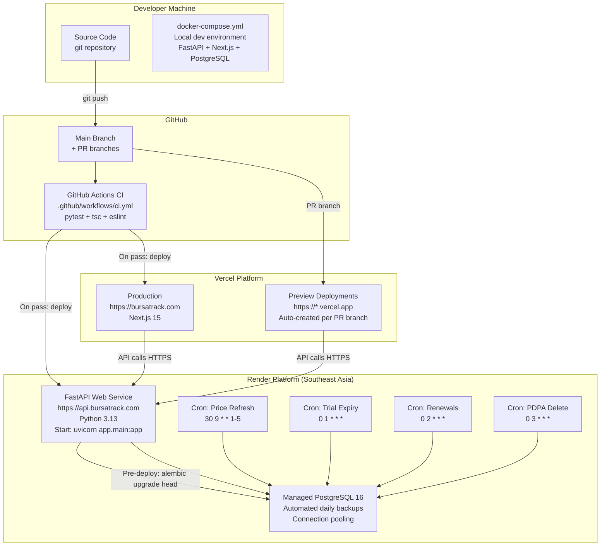

### 18.2 CI/CD Pipeline

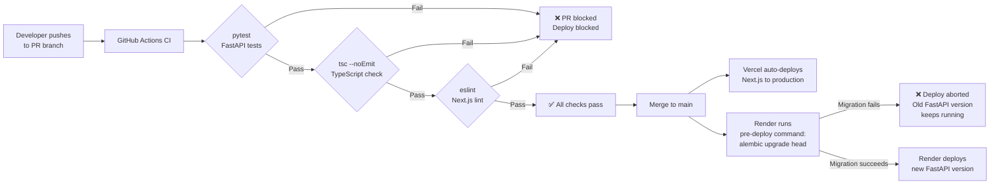

### 18.3 Environments

| Environment           | Purpose                        | URL pattern                              | Backend                                  |
| --------------------- | ------------------------------ | ---------------------------------------- | ---------------------------------------- |
| **Local development** | Feature development; debugging | `http://localhost:3000`                  | `http://localhost:8000` (Docker Compose) |
| **Vercel preview**    | Frontend branch review         | `https://bursatrack-*-*.vercel.app`      | Production Render API (see risk below)   |
| **Production**        | Live product                   | `https://bursatrack.com`                 | `https://api.bursatrack.com`             |

No staging environment at V1. Database migration safety is handled by the Render pre-deploy command abort mechanism.

> **HIGH-R-003 — Known risk: Vercel preview deployments target the production API.** A developer testing a frontend change on a PR preview branch will read and write real production data. Mitigation policy (mandatory before any preview testing):
> 1. All preview testing must use a dedicated test account (`test+preview@bursatrack.com` or equivalent) that holds no real user data.
> 2. Never test delete, import, or PDPA flows against real user accounts from a preview deployment.
> 3. A lightweight staging Render web service (~USD 7/month) pointed to a separate staging PostgreSQL instance is the recommended medium-term mitigation. Provision before the first paid user is onboarded.

> **MED-R-001 — Payment environment policy:** Local development and preview deployments must use Stripe test mode keys (`STRIPE_SECRET_KEY=sk_test_...`). Only the production Render environment is configured with live Stripe keys. This separation prevents test payments from reaching real payment rails and prevents real payments from being mislabelled as tests. Verify this is enforced in Render environment variable configuration before launch.

### 18.4 Rollback Procedure

**Frontend rollback:**

1. Open Vercel dashboard → Deployments
2. Select previous deployment → "Redeploy" (instant, no downtime)

**Backend rollback:**

1. Open Render dashboard → Deploys
2. Select previous successful deploy → "Redeploy" (takes ~60 seconds)
3. If database migration must be reversed: run `alembic downgrade -1` via Render Shell

**Rollback safety:** The backwards-compatible migration authoring rule (ADR-011) ensures that additive-only migrations can be rolled back by redeploying the previous application version — the previous version is compatible with the new schema (extra columns are ignored). Destructive operations that require an `alembic downgrade` are rare and must be explicitly planned.

---

## 19. Risks

### R-001 — yfinance API Reliability

**Severity:** High  
**Probability:** Medium  
**Description:** yfinance is an unofficial scraper with no SLA. Yahoo Finance has broken yfinance without notice on multiple documented occasions. An extended outage (multiple trading days) would prevent all portfolio valuations from updating, directly undermining the core product value proposition.  
**Mitigation V1:** Per-stock failure isolation; stale-data banner; manual price override; Sentry CRITICAL alert on >50% failure. Price integration abstracted behind `PriceProvider` interface for future substitution.  
**Mitigation V2:** Evaluate paid Bursa Malaysia data providers (EOD Historical Data, Alpha Vantage) as secondary or replacement source.  
**Residual risk:** If yfinance is broken for an extended period, the product degrades to a manual-entry tracker — still functional but loses its core automation differentiator.

### R-002 — qualifying_shares Invariant Regression

**Severity:** High  
**Probability:** Medium  
**Description:** PRD Section 14 still describes `DividendTranche.total_amount` as "derived" — directly contradicting BAS v2.0 CRIT-01. An engineer reading the PRD in isolation could implement the wrong model, causing retroactive corruption of dividend history when new lots are added.  
**Mitigation:** The PRD must be corrected before any implementation begins (Pre-Implementation Blocker #4). The invariant must be documented in schema definition comments and covered by a mandatory P0 regression test that cannot be skipped.  
**Status:** Pre-implementation blocker. **Do not begin schema design until PRD Section 14 is corrected.**

### R-003 — Floating-Point Calculation Error

**Severity:** High  
**Probability:** Low (if rules are followed) / High (if rules are violated)  
**Description:** Any `float` or `double` type used for a monetary calculation will eventually produce a rounding error. A single user-visible calculation error undermines the product's core claim of provable accuracy.  
**Mitigation:** Architectural Principle P-005 (exact decimal arithmetic) mandates `Decimal` (Python), `NUMERIC` (PostgreSQL), and `decimal.js` (TypeScript) everywhere. Code reviews must enforce this. CI must include tests for the specific rounding boundary cases documented in BR-025.  
**Residual risk:** A developer unfamiliar with the constraint could introduce a `float` in a new calculation. Mitigate with a linting rule or custom Pylint/Mypy check that flags `float` usage in calculation modules.

### R-004 — Stripe FPX Gap

**Severity:** Medium  
**Probability:** High (will materialise)  
**Description:** Stripe does not support FPX (Malaysian online banking transfer), which is the dominant payment method among Malaysian retail investors. Users who prefer FPX over credit card cannot subscribe.  
**Mitigation V1:** Document FPX as a known gap. Credit/debit card is available.  
**Mitigation V2:** Integrate Billplz as an FPX alternative checkout option for one-time payments; evaluate Stripe's FPX support timeline.

### R-005 — SST on Subscription Fees

**Severity:** Medium  
**Probability:** Unknown  
**Description:** SST (Sales and Service Tax) applicability on subscription fees has not been verified. If SST applies, it must be configured in Stripe Tax before the first payment is processed. Incorrect tax configuration creates compliance and accounting exposure.  
**Mitigation:** Obtain a tax opinion before launch. Configure Stripe Tax accordingly. This is a **pre-launch blocker**.

### R-006 — PDPA Compliance at Launch

**Severity:** Medium  
**Probability:** Low  
**Description:** Malaysian PDPA data export (FR-018) and account deletion (FR-019) must be reviewed by legal counsel for launch eligibility. If classified as launch-blockers, they are on the critical implementation path.  
**Mitigation:** Obtain legal opinion before first user registration. FR-018 and FR-019 are included in V1 scope.

### R-007 — SC Licensing for Sell Calculator

**Severity:** Medium  
**Probability:** Low  
**Description:** The Securities Commission of Malaysia may classify the sell scenario calculator as financial advice, requiring an SC licence.  
**Mitigation:** Non-dismissable T+2 disclosure (BR-020) and financial disclaimer (BR-021) are implemented on all calculation outputs. Obtain SC legal opinion before launch.

### R-008 — Cold Starts on Render Free Tier

**Severity:** Low  
**Probability:** High  
**Description:** Render's free tier spins down web services after 15 minutes of inactivity, causing ~30-second cold starts for the first user request after inactivity.  
**Mitigation:** Upgrade to Render starter plan (USD 7/month) at launch. Always-on service eliminates cold starts.

### R-009 — Bursa Stock Reference Staleness

**Severity:** Low  
**Probability:** Medium  
**Description:** The `stocks` table seeded at deployment will become stale as new IPOs are listed and delistings occur. A user attempting to add a newly listed stock will receive a false "stock not found" error.  
**Mitigation:** Admin script to add/update stock records without deployment. Establish a cadence of monthly reference data updates. The autocomplete falls back to free-text entry with server-side validation on submit — a missing stock code is caught and the user can notify support.

---

## 20. Future Evolution

### 20.1 Short-Term (V1.1)

**FPX payment support (Billplz):** Add Billplz as an alternative checkout path for Malaysian bank transfer payments. This requires adding a second webhook handler and payment state machine alongside Stripe.

**Singapore region migration:** When paying Malaysian users are present and API latency is a concern, migrate the Render FastAPI service to the Singapore region. This is a Render dashboard configuration change with a brief redeployment.

**Increased yfinance concurrency:** The V1 implementation uses `asyncio.gather` with semaphore(10). If price refresh window still exceeds 30 minutes at scale, increase the semaphore to 20-30 concurrent fetches. Yahoo Finance's unofficial rate limits must be observed — monitor for 429 responses and back off if observed.

**Tiered broker fee support (Rakuten Trade):** Rakuten Trade uses a tiered fee structure (fee percentage decreases above certain transaction amount thresholds). Implement tiered `BrokerConfig` records with tier breakpoints.

### 20.2 Medium-Term (V2)

**Multi-portfolio support:** Allow users to maintain multiple named portfolios (e.g., "KWSP Withdrawal", "EPF", "Personal"). This requires a breaking change to the portfolio ownership model — plan schema migration carefully.

**Read replica:** Add a PostgreSQL read replica on Render and route dashboard aggregate queries (the heaviest read workload) to the replica. Write operations continue to the primary.

**Materialised position aggregates:** If dashboard load times degrade beyond the 3-second NFR, pre-compute and cache position-level aggregates (total shares, total all-in cost, total dividend income YTD) in a `position_snapshot` table. Invalidate on any lot or dividend mutation. This is a correctness-risk area — implement only with comprehensive test coverage of the qualifying_shares invariant.

**Paid market data provider:** Evaluate EOD Historical Data, Alpha Vantage, or a Malaysian-specific data provider as a primary or fallback replacement for yfinance. Abstract behind the `PriceProvider` interface already established.

**APM and custom metrics:** Add Sentry Performance Monitoring or Prometheus metrics as user volume grows beyond 2,000 MAU. Instrument dashboard query latency, CSV import duration, and price refresh completion time.

### 20.3 Long-Term (V3+)

**Native mobile app:** React Native with the existing Next.js component library. The REST API requires no changes — mobile is an additional client.

**Dividend data integration:** Partner with a financial data provider to auto-suggest or pre-fill declared dividend amounts for Bursa-listed stocks. Eliminates manual dividend entry — the most friction-heavy remaining workflow.

**Multi-currency support:** For users with overseas holdings (SGX, HKX). Requires exchange rate integration and currency columns throughout the financial data model.

**Service extraction:** If team size grows beyond 3 engineers, extract `pricing` and `subscription` modules into independent services. The modular monolith architecture's domain boundaries (defined in ADR-001 and enforced by module interface contracts) make this extraction viable without major redesign.

---

## Appendix A — ADR Traceability Matrix

| Architecture decision                                              | Source ADR |
| ------------------------------------------------------------------ | ---------- |
| Modular monolith with 5 domain modules                             | ADR-001    |
| Python 3.13 / FastAPI / async SQLAlchemy                           | ADR-002    |
| Next.js 15 / TypeScript / Tailwind / shadcn/ui                     | ADR-003    |
| Client fee preview + server authoritative calculation              | ADR-003    |
| PostgreSQL 16 / NUMERIC types / Alembic                            | ADR-004    |
| Version-field optimistic locking on Lot and DividendTranche        | ADR-004    |
| Position aggregates computed at query time                         | ADR-004    |
| fastapi-users / JWT + token_version / bcrypt CF12                  | ADR-005    |
| Render native cron jobs (not APScheduler or Celery)                | ADR-006    |
| FastAPI BackgroundTasks + ImportJob table for CSV import           | ADR-006    |
| yfinance only + stale-data banner (no fallback)                    | ADR-007    |
| Stripe for payments + idempotency table                            | ADR-007    |
| Resend for transactional email                                     | ADR-007    |
| In-process TTLCache (1h) for stock reference + fee config          | ADR-008    |
| SWR with window-focus revalidation on frontend                     | ADR-008    |
| No Redis at any layer                                              | ADR-008    |
| PostgreSQL stocks table (seeded from static CSV)                   | ADR-009    |
| PDPA: retain PriceSnapshot, anonymise subscription billing records | ADR-009    |
| Transient tempfile for CSV uploads                                 | ADR-009    |
| Render managed PostgreSQL automated backups                        | ADR-009    |
| Vercel (Next.js) + Render (FastAPI + PostgreSQL + Cron)            | ADR-010    |
| Docker Compose for local dev; native PaaS for production           | ADR-010    |
| GitHub Actions CI (pytest + tsc + eslint)                          | ADR-011    |
| Render pre-deploy command: alembic upgrade head                    | ADR-011    |
| Backwards-compatible migration authoring rule                      | ADR-011    |
| Render + Vercel env vars for secrets; Pydantic BaseSettings        | ADR-012    |
| system_config PostgreSQL table for fee parameters                  | ADR-012    |
| structlog + Sentry + Sentry Cron Monitoring + BetterUptime         | ADR-013    |
| CORS allowlist: production domains + programmatic BursaTrack-prefix regex for Vercel previews | ADR-014    |
| SameSite=Lax + HTTP-only + Secure on JWT cookie                    | ADR-014    |
| SlowAPI in-process rate limiting                                   | ADR-014    |
| audit_log PostgreSQL table                                         | ADR-014    |
| Per-stock yfinance failure isolation + exponential backoff         | ADR-015    |
| In-task email retry (1 retry, Sentry on failure)                   | ADR-015    |
| Single Render instance for V1                                      | ADR-015    |

---

_Solution Architecture Document prepared by: Principal Software Architect_  
_All decisions traceable to: BursaTrack-ADR-Summary.md v1.0_  
_v1.1 revision based on: BursaTrack-Architecture-Review.md (2026-06-28)_  
_CRITICAL issues resolved: CRIT-R-001, CRIT-R-002, CRIT-R-003_  
_HIGH issues resolved: HIGH-R-001 through HIGH-R-012_  
_MEDIUM issues resolved: MED-R-001, MED-R-002, MED-R-003, MED-R-004, MED-R-005, MED-R-006, MED-R-007, MED-R-008_  
_Next document: Database Schema Design_
